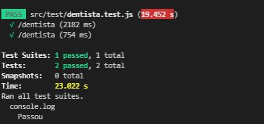

<h1> Projeto Fim do módulo 4 - Dentista API</h1>

API criada à partir das operações CRUD, para administração informações de profissionais dentistas. A API foi feita utilizando a linguagem Node.js.

<h1> Bibliotecas utilizadadas:</h1>

- Express para criar servidor; 
- SQLite3 para criar banco de dados; 
- Nodemon auxílio no servidor; 
- Supertest e jest para aplicação dos teste. 
 
As bibliotecas foram instaladas colocando os seguentes comando no terminal:

- npm init para criar arquivo package com as informações do projeto;
- npm i express;
- npm i sqlite3;
- npm i nodemon -D;
- npm i supertest.
- npm i jest;
  
Para rodar o sistema foi criado no script do arquivo package o scrpit dev, que com o comando npm run dev, roda o sistema com o nodemon.

<h1>Rodando as rotas CRUD</h1>

<h3>Get All</h3>

 Utilizando o endereço localhost:3333/dentista no insomnima na opção GET é possível ver todos os dados incluidos no banco de dados. 

Processo é feito conforme foto abaixo!

  

<h3>Get pesquisa pelo CRO</h3>

 Utilizando o endereço localhost:3333/dentista/CRO no insomnima na opção GET é possível ver todos os dentista com o CRO informado 

Processo é feito conforme foto abaixo!

 
<h3>POST</h3>

 Utilizando o endereço localhost:3333/dentista no insomnima na opção POST, indo a opção body e escolhendo json e incluindo no corpo os dados que deseja, é possível incluir dados no banco de dados  

Processo é feito conforme foto abaixo!

 
<h3>DELETE</h3>

 Utilizando o endereço localhost:3333/dentista/CRO no insomnima na opção DELETE, é possível excluir do banco de dados o cadastro que possui o CRO informado   

Processo é feito conforme foto abaixo!

 
<h3>PUT</h3>

 Utilizando o endereço localhost:3333/dentista/CRO no insomnima na opção PUT,indo a opção body e escolhendo json e incluindo no corpo os dados que deseja alterar Assim, os dados do CRO informado serão alterado no banco de dados.   

Processo é feito conforme foto abaixo!

<h1>Testes</h1>

O testes são aplicados utilizando as bibliotecas supertest e jest.

 São feitos conforme imagens a seguir.

Para testar a rota GET All, que mostra todos os usuários, utilizei o seguninte código.

   

Para testar a rota POST, que mostra todos os usuários, utilizei o seguninte código

  

Como resultado dos teste foi obtido

